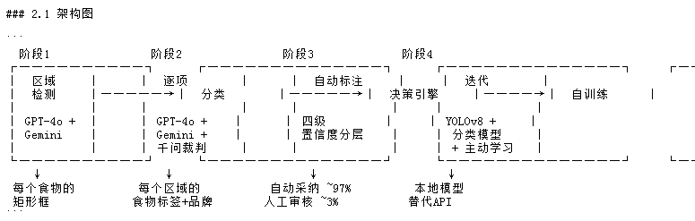

# 🎯 VLM-ActiveLabel-Distill: 多模态大模型智能标注与端侧模型蒸馏闭环系统

[](https://www.python.org/)
[](LICENSE)
[]()
[]()

> **An End-to-End Multimodal Active Annotation & Edge Model Distillation Framework**  
> 一套基于“多模态大模型协同定位 + 裁判模型语义仲裁 + 四级置信度主动分流 + 本地小模型蒸馏”的工业级数据闭环流水线。

> [!NOTE]
> **声明 (Disclaimer)**：本项目仅作为个人实习/项目技术方案 Demo 演示、功能测试与技术方案存档之用 (For Demo, Testing & Archival Purposes Only)。请勿在生产环境公开暴露您的个人 API 密钥。

---

## 📌 背景与核心痛点
在实际产业视觉场景（如零售检测、工业质检、食物分类）中，端到端依赖商业大模型 API（如 GPT-4o / Qwen-VL）存在两大瓶颈：
1. **推理成本极高**：单张大图消耗 1500+ Tokens，海量图像线上推理成本难以承受；
2. **全人工标注周期长**：小模型冷启动需数万标注样本，传统人工标注耗时长、成本大。

本项目提出一种**降本增效的闭环架构**：利用多模态大模型作为高精度“自动化标注流水线”，通过裁判机制与主动学习筛选出 97% 免检样本，沉淀为高质量数据训练本地轻量化模型（YOLOv8），从而实现**对商业大模型 API 的平替与推理成本 90%+ 的下降**。

---

## 🏗️ 系统架构设计 (System Architecture)



系统分为四大标准流水线阶段：

```
[输入原始图像] 
       │
       ▼
【阶段 1: 区域检测 (Localization)】
   └── 调度 VLM (GPT-4o / Qwen-VL) 专心提取目标候选边界框 (Bounding Boxes)
       │
       ▼
【阶段 2: 局部裁剪与多模型裁判分类 (Classification & Judge)】
   ├── 利用 PIL 对候选区域实施毫秒级特征特写裁剪 (Crop)
   ├── 驱动双模型 (Model A & B) 背靠背无状态分类投票
   └── 若产生语义分歧，自动唤醒【千问裁判 (LLM-as-a-Judge)】进行深度裁决
       │
       ▼
【阶段 3: 四级置信度决策引擎 (Confidence Gate & Human-in-the-Loop)】
   ├── Level 1 (共识直通) & Level 2 (高分仲裁): 自动采纳 (~97%)
   └── Level 3 (边缘分歧): 自动包装为 Label Studio Task 格式，交由人工兜底复核 (~3%)
       │
       ▼
【阶段 4: 数据归一化与端侧小模型蒸馏 (Distillation to YOLO)】
   ├── 绝对像素坐标自动归一化为 YOLO (0~1) 相对比例格式
   └── 生成 dataset.yaml 配置文件，启动本地 YOLOv8 迭代训练，替代线上 API
```

---

## 📂 项目结构 (Project Structure)

```text
VLM-ActiveLabel-Distill/
├── assets/
│   └── architecture.png       # 系统架构设计图
├── config.py                  # 硅基流动 API 与模型选型配置中心
├── core/
│   ├── __init__.py
│   ├── detector.py            # 阶段1：VLM 目标定位与坐标解析
│   ├── classifier.py          # 阶段2：局部裁剪与多模型裁判仲裁机制
│   ├── confidence_engine.py   # 阶段3：四级置信度引擎与 Label Studio 任务构建
│   ├── yolo_exporter.py       # 阶段4：坐标归一化转换与 YOLO 配置文件生成
│   └── visualizer.py          # 可视化引擎：自动在原图上画框并标注类别置信度
├── data/
│   └── inputs/                # 测试图片输入目录 (已放置 01_burger, 02_fruits, 03_coffee 等)
├── output/
│   ├── visualized/            # 【重点】画好边界框的可视化图像输出目录 (用于直观验框)
│   ├── labels/                # YOLO 格式标注文件 (.txt)
│   └── dataset.yaml           # YOLOv8 训练配置文件
├── demo.py                    # 批量流水线端到端运行脚本 (支持 Mock 与真实 API)
├── requirements.txt           # 项目依赖
└── README.md                  # 项目中英文技术白皮书
```

---

## 🚀 快速上手 (Quick Start)

### 1. 激活环境与安装依赖
推荐使用本地专用的 `llm` Conda 环境：
```bash
# 激活你的大模型环境
conda activate llm

# 进入项目目录并安装依赖
cd e:\Antigravity\Internship\VLM-ActiveLabel-Distill
pip install -r requirements.txt
```

### 2. 配置大模型 API Key
打开 `config.py`，填入硅基流动（SiliconFlow）申请的 API 密钥：
```python
SILICONFLOW_API_KEY = "sk-xxxxxxxxxxxxxxxxxxxxxxxx"
```
*(默认自动直连国内高速节点，且已适配 `Qwen3-VL-8B` 与 `Qwen3-VL-32B` 旗舰多模态模型)*

### 3. 一键运行批量标注流水线
将你要测试的图片放入 `data/inputs/` 目录下（支持批量 `.jpg` / `.png`），直接运行：
```bash
python demo.py
```

### 4. 实时查看画框效果 (验框)
运行完成后，直接进入 `output/visualized/` 文件夹即可查看每张图的画框结果：
* **绿色框 (Level-1/2)**：代表大模型高度确信，自动采纳入库（~97%）；
* **黄色框 (Level-3)**：代表模型间存在分歧或疑难杂症，已自动生成 Label Studio 任务待人工复核（~3%）。

---

## 📊 核心技术亮点 (Key Innovations)

1. **检测与分类解耦 (Decoupled Detection & Classification)**：
   * 彻底避免多目标大图一次性推理导致的“大模型注意力涣散与格式幻觉”，大幅提升长尾类别识别率。
2. **多模型仲裁机制 (LLM-as-a-Judge)**：
   * 引入第三方法官模型解决两路模型分歧，将大模型的非对称优势（“验证能力远强于生成能力”）发挥到极致。
3. **主动学习数据飞轮 (Active Learning Data Flywheel)**：
   * 只把模型打架、置信度低于阈值的 3% 异常样本推给 Label Studio，以最小的人工成本锁定 100% 的数据底线。
4. **无缝对接工业级端侧小模型**：
   * 自动生成标准的 YOLOv8 `dataset.yaml` 与标注文件，无缝衔接模型微调与量化上线。

---

## 📜 许可证 (License)
本项目采用 [MIT License](LICENSE) 开源许可证。
